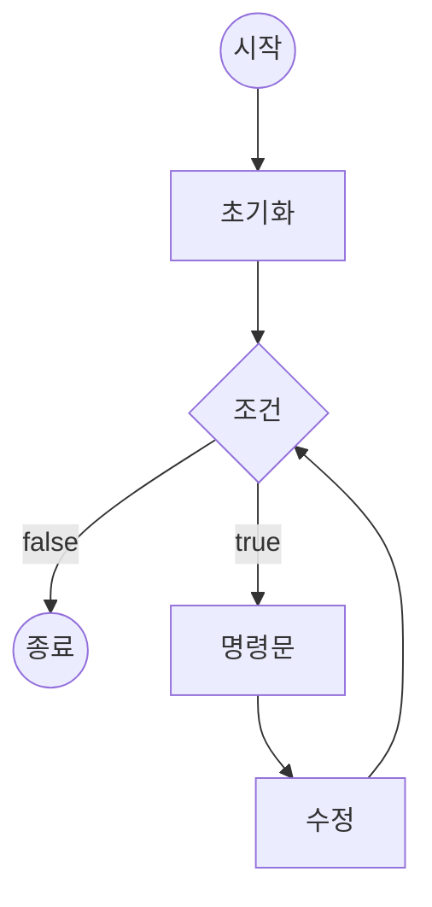

## 자바스크립트 배열

배열은 가장 일반적으로 사용되는 자료 구조, 자바스크립트 배열에는 내장된 메소드가 많다.  
경우에 따라 동일한 종류의 배열 연산을 다양한 방법으로 수행할 수 있다.

### 삽입

#### `.push(element)`
  - 새로운 항목을 배열 끝에 추가
  - 시간 복잡도: O(1)

### 삭제

#### `.pop(element)`
  - 마지막 항목을 배열에서 제거, 제거된 항목을 반환
  - 시간 복잡도: O(1)

#### `.shift(element)`
  - 첫 번째 항목을 배열에서 제거, 제거된 항목을 반환
  - 시간 복잡도: O(1)

### 접근
접근 연산은 인덱스를 사용해 메모리의 주소로부터 직접 값을 얻기 때문에 O(1) 시간 복잡도를 지닌다.

### 반복
자료 구조 내에 담긴 항목들을 하나씩 접근하는 과정, 해당 방법들은 모두 O(n)의 시간 복잡도를 지닌다.


#### `for(변수; 조건; 수정)`


#### `while(조건)`
- 조건이 참인 경우 반복 문 종료, 계수기는 루프의 바깥에서 초기화 되어야 한다.

#### `for(변수 in 배열)`
- 배열의 길이 만큼 인덱스를 하나씩 호출한다. in 앞에 변수는 배열의 인덱스 이다.

#### `for(변수 of 배열)`
- 배열의 길이 만큼 하나씩 호출한다. of 앞에 변수는 해당 배열 항목의 값이다.

#### `forEach()`
- 다른 반복 방법과 다르게 반복 바깥으로 빠져나오거나 배열 내 특정 항목들을 건너뛸 수 없다.  
- 각 항목을 모두 접근한다는 의미에 있어 좀 더 명시적이다.


### 도움 함수  

#### `.slice(begin, end)`
- 기존 배열을 수정하지 않고 해당 배열의 일부를 반환한다.
- (시작 인덱스, 끝 인덱스) 두 개의 매개변수를 받는다.
- 시작 인덱스만 매개변수로 전달한 경우 끝 인덱스는 해당 배열의 인덱스 최댓값으로 가정한다.
- 매개변수로 아무것도 전달하지 않는 경우 배열의 복사본을 반환한다. (깊은 복사)
- 시간 복잡도: O(n)  <--뇌피셜

#### `.from()`
- 유사 배열 객체(array-like object)나 반복 가능한 객체(iterable object)를 얕은 복사하여  
새로운 Array 객체 생성
- n개의 항목을 복사해야 하기 때문에 O(n) 시간 복잡도를 갖는다.

#### `.splice(begin, size, element1, element2...)`
- 기존 항목을 제거하거나 신규 항목을 추가함으로써 배열의 내용을 변경하고 반환한다.
- (시작 인덱스, 제거할 항목의 크기(길이, 갯수), 추가할 신규 항목...) 세 개의 매개변수를 받는다.
- 새로운 항목들은 첫 번째 매개변수에서 지정한 위치에 추가된다.
- 제거된 항목들은 반환
- 시간 복잡도: 최악의 경우 O(n)

#### `.concat()`
- 신규 항목을 배열의 맨 뒤에 추가하고 해당 배열을 반환한다.(배열과 배열을 연결한다.)

#### `.length` 속성
- 배열의 크기를 반환한다.
- 해당 속성을 더 작은 크기로 변경하면 배열에서 항목들이 제거된다.

#### `...` 전개 연산자
- 제로 인자(zero arguments)가 기대되는 곳에서 인자를 확장하는 데 사용된다.
- 배열을 깊은 복사할 때 응용 할 수도 있다.

#### `Math.max`, `Math.min`
- 무한 개의 매개변수를 받는다.
- 전개 연산자와 함께 사용해서 배열의 최댓값, 최솟값을 찾을 수 있다.

```javascript
// 배열 안 최댓값
Math.max(...Array);

// 배열 안 최솟값
Math.min(...Array);
```

### 자바스크립트 함수형 배열 메소드 (고차 함수)
#### `map(function( value ){})`
- 매개변수로 전달된 함수 변환을 배열의 모든 항목에 적용하고 변환된 항목들을 포함하는 신규 배열을 반환한다.
- 원본 배열을 변경하지 않는다.

#### `filter(function( value ){})`
- 배열 내 항목들 중 함수의 매개변수로 절단된 조건을 중족시키는 배열들만 반환한다.
- 원본 배열을 변경하지 않는다.

#### `reduce(function( prevVal, currentVal, index, array ){}, initialVal)`
- 매개변수로 전달된 변환 함수를 사용해 배열의 모든 항목을 하나의 값으로 결합한다.
- initialValue를 두 번째 인자로 받을 수 있다. 해당 인자는 감소 값을 초기화 한다.
- 원본 배열을 변경하지 않는다.
