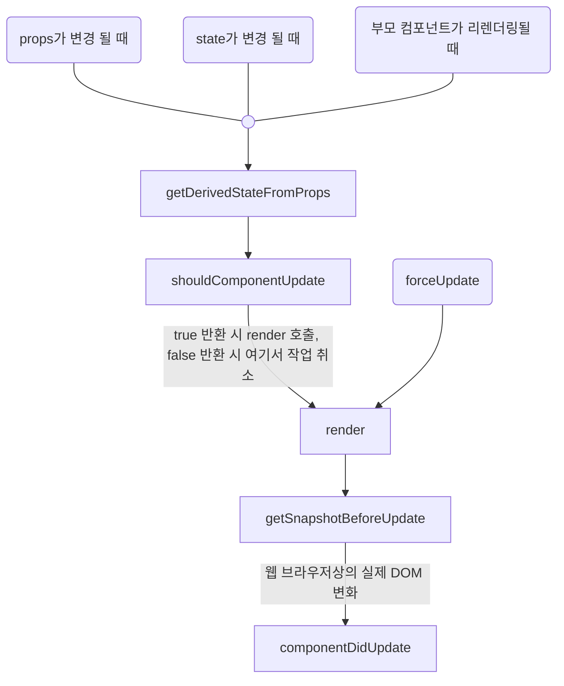
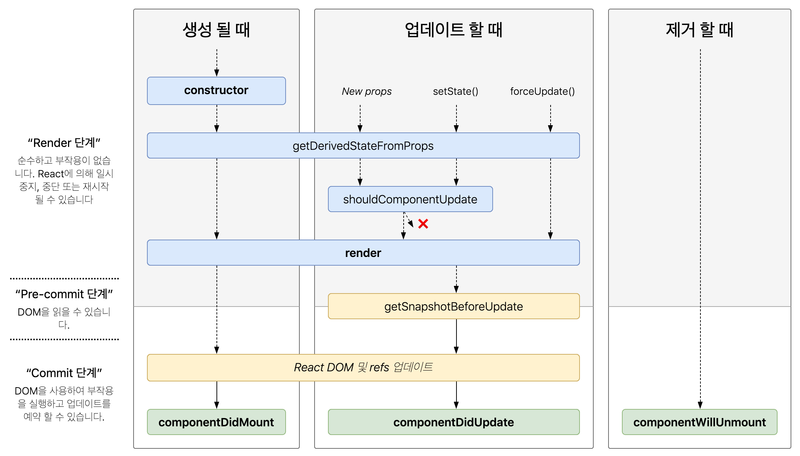

# React Life Cycle

리액트 컴포넌트의 수명은 페이지에서 렌더링되기 전인 준비 과정에서 시작하여 페이지에서 사라질 때 끝난다.

컴포넌트의 라이프사이클 메서드를 사용하면 처음 렌더링될 때 혹은 업데이트하기 전후로 어떤 작업을 처리해야 하거나 불필요한 업데이트를 방지할 수 있다.

라이프사이클 매서드는 클래스형 컴포넌트에서만 사용할 수 있고 함수형 컴포넌트에서는 사용할 수 없다. 하지만 Hooks를 사용하면 비슷한 작업을 처리할 수 있다.


## 라이프사이클 메소드

라이프사이클 메소드는 총 9가지 이고 총 세 가지의 큰 카테고리로 나눌 수 있다.


### Mount(마운트)

DOM이 생성되고 웹 브라우저상에 나타다는 것을 mount라고 한다.

- **constructor** :  
  컴포넌트를 새로 만들 때 마다 호출되는 클래스 생성자 메소드
- **getDerivedStateFormProps** :  
  props에 있는 값을 state에 넣을 때 사용하는 메소드
- **render** :  
  우리가 준비한 UI를 렌더링하는 메소드
- **componentDidMount** :  
  컴포넌트가 웹 브라우저상에 나타난 후 호출하는 메소드


### Update(업데이트)

#### 컴포넌트가 업데이트되는 경우

- props가 변경 될 때
- state가 변경 될 때
- 부모 컴포넌트가 리렌더링될 때
- this.forceUpdate로 렌더링을 강제로 트리거할 때

#### 컴포넌트를 업데이트할 때 호출하는 메소드



- **getDerivedStateFromProps** :  
  마운트 과정, 업데이트 시작하기 전 호출 props의 변화에 따라 state 값에도 변화를 주고 싶을 때 사용
- **shouldComponentUpdate** :  
  컴포넌트가 리렌더링을 해야 할지 말아야 할지 결정하는 메소드
- **render** :  
  컴포넌트를 리렌더링한다.
- **getSnapshotBeforeUpdate** :  
  컴포넌트 변화를 DOM에 반영하기 바로 직전에 호출하는 메소드
- **componentDidUpdate** :  
  컴포넌트의 업데이트 작업이 끝난 후 호출하는 메소드


### Unmount(언마운트)

컴포넌트를 DOM에서 제거하는 것을 unmount라고 한다.

- **componentWillUnmount** :  
  컴포넌트가 웹 브라우저상에서 사라지기 전에 호출하는 메소드


## 라이프사이클 메소드 자세히 살펴보기

### render()

라이프사이클 메소드 중 유일한 필수 메소드, 컴포넌트의 모양새를 정의하고 이 메소드 안에서 this.props와 this.state에 접근할 수 있고 리액트 요소를 반환한다.

> render 안에서는 이벤트 설정이 아닌 곳에서 setState를 사용하면 안 되고 DOM에 접근해도 안 된다.  
> DOM 정보를 가져오거나 state에 변화를 줄 때는 componentDidMount에서 처리해야 한다.


### constructor

컴포넌트를 만들 때 처음으로 실행되는 생성자 메소드, 초기 state를 정할 수 있다.


### getDerivedStateFromProps

props로 받아 온 값을 state에 동기화시키는 용도로 사용하고 컴포넌트가 마운트될 때와 업데이트 될 때 호출된다.

> 리액트 v16.3 이후에 새로 만든 라이프사이클 메소드

```jsx
static getDerivedStateFromProps(nextProps, prevState) {
	if(nextProps.value !== prevState.value) { // 조건에 따라 특정 값 동기화
  	return { value: nextProps.value };
  }
  return null; // state를 변경할 필요가 없다면 null을 반환
}
```


### componentDidMount

컴포넌트를 만들고 첫 렌더링을 다 마친 후 실행, 이 메소드 안에서 다른 자바스크립트 라이브러리 또는 프레임워크의 함수를 호출하거나 이벤트 등록, setTimeout, setInterval, 네트워크 요청 같은 비동기 작업을 처리할 수 있다.


### shouldComponentUpdate

props 또는 state를 변경했을 때 리렌더링을 시작할지 여부를 지정하는 메소드

true 혹은 false 값을 반환하고 true를 반환하면 다음 라이프사이클 메소드를 계속 실행하고 false를 반환하면 업데이트 작업을 중지한다. 컴포넌트에 이 메소드를 따로 생성하지 않으면 기본적으로 true 값을 반환한다.

props와 state는 this.props와 this.state로 접근하고, 새로 설정될 props 또는 state는 nextProps와 nextState로 접근할 수 있다.

> `this.forceUpdate()` 함수를 호출하면 이 과정을 생략하고 바로 render 함수를 호출한다.


### getSnapshotBeforeUpdate

render에서 만들어진 결과물이 브라우저에 실제로 반영되기 직전에 호출되는 메소드

반환하는 값은 componentDidUpdate에서 세 번째 파라미터인 snapshot 값으로 전달받을 수 있고, 업데이트 하기 직전의 값을 참고할 일이 있을 때 활용된다.

```jsx
// 예: 스크롤 바 위치 유지
getSnapshotBeforeUpdate(prevProps, prevState) {
  if(prevState.array !== this.state.array) {
  	const { scrollTop, scrollHeight } = this.list;
    return { scrollTop, scrollHeight };
  }
}
```


### componentDidUpdate

```jsx
componentDidUpdate(prevProps, pervState, snapshot) { ... }
```

리렌더링을 완료한 후 실행, 업데이트가 끝난 직후이므로 DOM 관련 처리를 해도 되고 prevProps 또는 prevState를 사용하여 컴포넌트가 이전에 가졌던 데이터에 접근할 수 있다. 

getSnapshotBeforeUpdate에서 반환한 값이 있다면 여기서 snapshot 값을 전달받을 수 있다.


### componentWillUnmount

컴포넌트를 DOM에서 제거할 때 실행하고 componentDidMount에서 등록한 이벤트, 타이머, 직접 생성한 DOM이 있다면 여기서 제거 작업을 해야 한다.


### componentDidCatch

컴포넌트가 렌더링 되는 도중 에러가 발생하면 호출되는 메소드 애플리케이션이 멈추지 않고 오류 UI를 보여 줍니다.

```jsx
componentDidCatch(error, info) {
	this.setState({
  	error: true
  });
  console.log({error, info});
}
```

error는 파라미터에 어떤 에러가 발생했는지 알려주고 info 파라미터는 어디에 있는 코드에서 오류가 발생했는지에 대한 정보를 알려준다. 오류가 발생하면 서버 API를 호출하여 따로 수집할 수도 있다.

> 컴포넌트 자신에게 발생하는 에러를 잡아낼 수 없고 자신의 this.props.children으로 전달되는 컴포넌트에서 발생하는 에러만 잡아낼 수 있다.

> 리액트 v16에서 추가되었다.


## 라이프사이클 한눈에 보기



[React lifecycle methods diagram](https://projects.wojtekmaj.pl/react-lifecycle-methods-diagram/)

