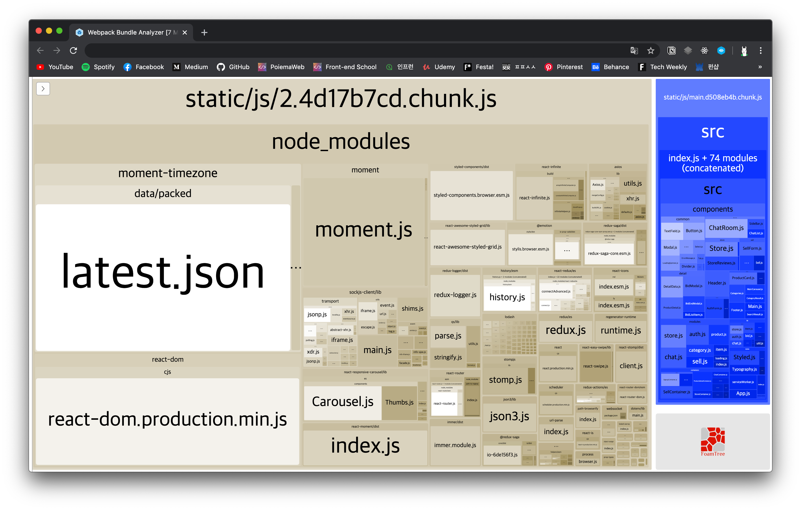

# CRA에서 eject 없이 webpack-bundle-analyzer 사용하기

CRA 공식 문서에서 번들 분석 도구로 [source-map-explorer](https://create-react-app.dev/docs/analyzing-the-bundle-size)를 소개 해주지만, 컬러풀하고 많이 사용하는 [webpack-bundle-analyzer](https://github.com/webpack-contrib/webpack-bundle-analyzer)를 사용해보고 싶었다!

하지만 `eject`를 해야하는 부담 때문에 구글링 해서 [이 방법](https://github.com/facebook/create-react-app/issues/3518#issuecomment-454144586)으로 시도해봤으나 안됀다..😢

그러다 CRA에서 `eject` 없이 사용할수 있게 해주는 [cra-bundle-analyzer](https://github.com/svengau/cra-bundle-analyzer)라는 패키지를 발견해서 적용해보니 아주 잘된다!


## 설치

먼저 *webpack-bundle-analyzer*를 devDependencies로 설치하고

```sh
$ yarn add -D webpack-bundle-analyzer
```

*cra-bundle-analyzer*도 devDependencies로 설치

```sh
$ yarn add -D cra-bundle-analyzer
```

아래 명령어를 실행하면 `/build/report.html`가 static으로 생성된다.

```sh
$ npx cra-bundle-analyzer
```


## 결과



위와 같이 잘 나온다. 이제 결과를 참고로 번들 사이즈를 최적화 하면된다!

팀원이 설치한 `moment-timezone`이 저렇게 큰 크기를 차지하고 있는 줄 몰랐는데 코드를 확인해보고 필요한 부분만 적용하던가 지워야겠다.

