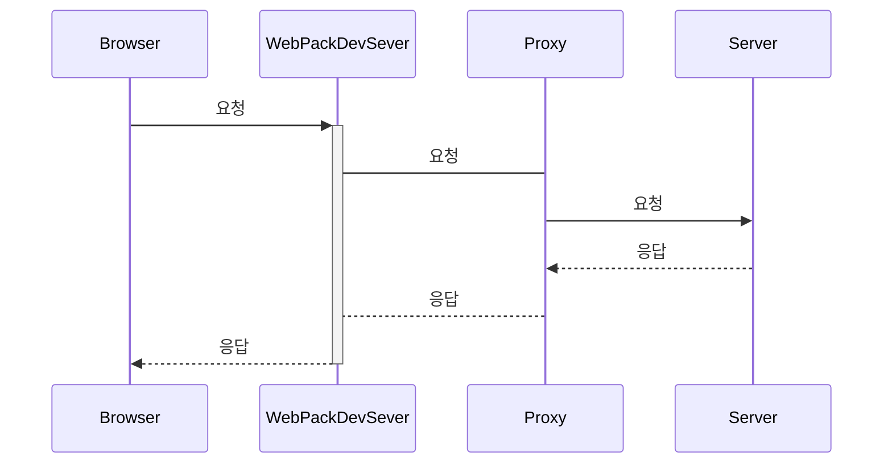

# 동일 출처 정책과 교차 출처 리소스 공유

프론트엔드 개발을 하다 보면 한번은 경험하게 되는 CORS 이슈와 SOP를 설명하는 여러 글을 참고하여 중요한 점만 조각 모음 해봤다.


## SOP(Same-origin policy, 동일 출처 정책)

자바스크립트 엔진 표준 스펙의 보안 규칙으로 **하나의 출처(Origin)에서 로드된 자원(문서나 스크립트)**이 **호스트나 프로토콜, 포트번호가 일치하지 않는 자원과 상호작용 하지 못하도록 요청 발생을 제한**하고, **동일 출처(Same Origin)에서만 접근이 가능한 정책**

> 두 URL의 Port(명시한 경우), Protocol, Host가 모두 같아야 **Same Origin**  
> "scheme/host/port 튜플(tuple)" 혹은 그냥 "tuple"이라고 하기도 한다.

> **Internet Explorer 예외사항** 😠
>
> IE는 동일 출처 정책에 두 가지 중요한 예외가 있고 **비표준**이며 다른 브라우저에서는 지원하지 않는다.
>
> - **신뢰할 수 있는 사이트**
>
>   양쪽 도메인 모두가 높음 단계의 보안 수준을 가지고 있는 경우 동일 출처 제약을 적용하지 않는다.
>
> - **포트**
>
>   Internet Explorer는 동일 출처 정책 검사에 포트를 포함하지 않는다.


## CORS(Cross-Origin Resource Sharing, 교차 출처 리소스 공유)

웹 애플리케이션은 자신의 출처와 동일한 리소스만 불러올 수 있으며, **다른 출처의 리소스를 불러오려면 그 출처에서 올바른 CORS 헤더를 포함한 응답을 반환해야 한다.** 이는 시스템 수준에서 타 도메인 간 자원 호출을 승인하거나 차단하는 것을 결정하는 것이다.

CORS는 웹페이지상에서 자바스크립트를 이용하여 **XHR(XMLHttpRequest)을 다른 도메인으로 발생 시킬 수 있도록 해주는 기능**을 가지고 있고 XHR 기반 **cross-origin HTTP 요청을 이용하여 자원을 공유해야 하는 브라우저와 서버 간의 안전한 교차 출처 요청 및 데이터 전송을 지원**한다.


## CORS 해결? CORS 이슈 해결!

흔히 'CORS 해결'이라고 표현하기 때문에 CORS 자체가 이슈나 에러라고 착각하기 쉬운 것 같다.  

CORS는 에러가 아니고 앞서 정리 했듯 서로 다른 origin 간에 리소스를 전달하는 방식을 제어하는 매커니즘이다.

CORS 이슈는 **동일 출처 정책(SOP)에 의거해 다른 출처의 리소스를 사용하거나 상호작용을 하지 못하도록 막고 경고가 발생 하는 것** 이고, **이를 해결하기 위해 교차 출처 리소스 공유(CORS)를 사용해 접근을 허용 하도록 설정**하는 것이다.

그러니 'CORS 해결'을 더 명확하게 표현하면 'CORS 이슈 해결'이라 할 수 있겠다.


## CORS 이슈 해결 방법

여러가지 방법이 있지만 CORS 이슈를 해결하기 위해 많이 사용하는 방법을 간단하게 정리 해봤다.


### 동일 출처로 이동

정말 단순하게 같은 출처로 이동 시키면 해결! 🤓


### 서버에서 Access-Control-allow-origin 헤더 추가

서버에서 모든 클라이언트에 요청에 대한 cross-origin HTTP 요청을 허가하는 `Access-Control-Allow-Origin: *` 헤더를 추가하면 된다. 하지만 이렇게 설정하면 전체 호스트에 대한 요청을 허용하는 것이기 때문에 보안에 취약 할 수 있다.

> **Access-Control-Allow-Origin**
>
> `Access-Control-Allow-Origin` 응답 헤더는 이 응답이 주어진 [origin](https://developer.mozilla.org/ko/docs/Glossary/Origin)으로부터의 요청 코드와 공유될 수 있는지를 나타낸다.


### Proxy

Proxy Server는 헤더를 추가하거나 요청을 허용/거부하는 역할을 중간에서 해줄 수 있기 때문에 응답을 주고 받을때 프록시 서버에서  `Access-Control-Allow-Origin: *` 헤더를 담아 응답해 주면 된다.

프로젝트를 개발 할 때 proxy를 사용하는 것은 필수적인건 아니지만, 백엔드에서 개발서버를 위한 CORS 설정을 안해도 돼서 불필요한 코드를 아낄 수 있다.

#### webpack-dev-server proxy

프론트엔드에서 webpack-dev-server proxy 기능을 사용하면 서버쪽 코드를 수정하지 않고 해결 할 수 있다.



webpack-dev-server의 프록시를 사용하면, 브라우저에서  API를 요청 할 때 백엔드 서버에 직접적으로 요청을 하지 않고, 현재 개발서버의 주소로 요청을 하게 된다. 해당 요청을 받아 그대로 백엔드 서버로 전달, 백엔드 서버에서 응답한 내용을 다시 브라우저쪽으로 반환한다.

CRA(create-react-app)로 생성한 프로젝트라면 package.json에 proxy 값을 설정하여 간단하게 webpack-dev-server proxy 기능을 활성화 할 수 있다.


## 배포 할때는

API가 동일한 도메인에서 제공이되는 경우는 문제 없지만 API의 도메인과 서비스의 도메인이 다르다면 axios의 글로벌 [baseURL](https://github.com/axios/axios#global-axios-defaults)을 설정하면 된다.

```javascript
axios.defaults.baseURL = process.env.NODE_ENV === 'development' ? '/' : '{API 도메인}';
```

> `process.env.NODE_ENV`는 현재 환경이 프로덕션인지 개발모드인지 알 수 있는 값 ([참고](https://create-react-app.dev/docs/adding-custom-environment-variables))

개발 환경에선 프록시 서버 쪽으로 요청하고, 프로덕션에선 실제 API 서버로 요청을 하게 된다.


## (부록) CORS 관련 보안 이슈

CORS의 근본적인 보안문제는 XHR을 다른 도메인으로 발생시킬 때, 사용자에게 허가 요청을 받지 않는다는 것이다.  
이러한 문제는 사용자의 세션을 오용한 접근제어와 관련된 보안 문제를 야기할 수 있다. 공격자가 사용자의 세션을 오용할 수 있게 된다는 것은 접근제어를 우회하여 허가되지 않은 리소스에 접근할 수 있다는 의미이다. 

> **접근제어 우회**
>
> 사용자가 속해있는 내부 네트워크에 존재하는 웹사이트가 “Access-Control-AllowOrigin” 응답 헤더를 잘못 정의했을 경우 공격자는 외부에서 직접 접근할 수 없는 내부 네트 워크의 웹사이트에 접근할 수 있다. 

> **CORS와 Web Socket을 이용한 원격 쉘**
>
> XHR과 Web Socket 기술을 이용하면 사용자의 브라우저 세션을 탈취하고 행동을 제어할 수 있다. 대표적인 예로 세션 하이재킹 공격이 있다.

> **CORS와 Web Socket을 이용한 웹 기반**
>
> CORS와 Web Socket 기술을 이용하면 사용자의 브라우저들을 제어하여 다양한 정보를 수 집하거나 명령을 내릴 수 있다.

> **CORS와 Web Worker를 이용한 DDoS 공격**
>
> CORS와 Web Worker를 이용하면 보다 효과적으로 DDoS 공격을 수행할 수 있다.

*출처: [HTML5 신규 웹서비스 환경에서의 보안 이슈 - 한국인터넷진흥원](https://www.kisa.or.kr/jsp/common/downloadAction.jsp?bno=158&dno=117&fseq=1)*


## TL ; DR

- SOP는 출처가 다른 자원과 상호작용 하지 못하도록 제한한다.

SOP는 잠재적으로 해로울 수 있는 다른 출처에서 가져온 리소스와 상호작용하는 것을 제한하고 분리함으로써 가능한 공격 경로를 줄여 준다.

- CORS를 허용 하려면 서버에서 cross-origin HTTP 요청을 허가하는 헤더를 설정 해주어야 한다.

CORS는 출처(도메인, 포트, 프로토콜)가 다른 서버의 자원에 접근할 수 있는 권한을 부여하도록 브라우저에 요청하는 매커니즘, 리소스가 자신의 출처와 다를 때 cross-origin HTTP 요청을 실행한다.

- CORS 이슈는 SOP에 의거해 발생한다.

SOP에 의거해 다른 출처의 리소스와 상호작용 하는 것이 차단되는데 CORS를 설정 함으로써 상호작용이 가능 해진다.

- 클라이언트 사이드 개발 과정에서는 프록시를 사용해 해결 가능하다.

백엔드 개발자에게 요청해 서버에서 설정해도 되지만, 클라이언트와 서버 사이 프록시를 통해 Access-Control-Allow-Origin 헤더를 설정 할 수 있다. 이렇게 하면 백엔드에서 따로 설정할 필요가 없어진다!


### 두 줄 요약

SOP는 같은 origin을 가진 리소스만 접근이 가능하도록 제한한다.  
CORS는 도메인 또는 포트가 서로 다른 origin 간에 리소스를 전달하는 방식을 제어하는 매커니즘이다.


## reference

[교차 출처 리소스 공유 (CORS) - HTTP | MDN](https://developer.mozilla.org/ko/docs/Web/HTTP/CORS)

[Access-Control-Allow-Origin - HTTP | MDN](https://developer.mozilla.org/ko/docs/Web/HTTP/Headers/Access-Control-Allow-Origin)

[동일 출처 정책 - 웹 보안 | MDN](https://developer.mozilla.org/ko/docs/Web/Security/Same-origin_policy)

[CORS에 대한 간단한 고찰 | Velog](https://velog.io/@wlsdud2194/cors)

[SOP, CORS | Velog](https://velog.io/@songsong2920/SOP-CORS)

[CORS 와 해결방법 (express, proxy) | Velog](https://velog.io/@kimtaeeeny/CORS-와-해결방법-express-proxy-FE-study8)

[CORS: Real examples | Velog](https://velog.io/@leejh3224/CORS-Real-examples-8yjnloovl5)

[NodeJS X CRA (proxy) | Velog](https://velog.io/@ground4ekd/nodejs-cra-proxy)

[CORS 와 Webpack DevServer Proxy · GitBook](https://react.vlpt.us/redux-middleware/09-cors-and-proxy.html)

[CORS - amessinger](https://gist.github.com/amessinger/f3eed0f37a1f71840714a6e419f7d236)

[ajax - What are the security risks of setting Access-Control-Allow-Origin? | Stack Overflow](https://stackoverflow.com/questions/12001269/what-are-the-security-risks-of-setting-access-control-allow-origin)

[HTML5 신규 웹서비스 환경에서의 보안 이슈 - 한국인터넷진흥원](https://www.kisa.or.kr/jsp/common/downloadAction.jsp?bno=158&dno=117&fseq=1)
